# 🚀 HRMS (Human Resource Management System) - Flutter UI Showcase

Welcome to the UI showcase for the **HRMS** web application built with **Flutter**!

This repository displays the various screens designed for a comprehensive Human Resource Management System, catering to Admins, Department Heads, Accountants, and Employees.

---

## ✨ Features at a Glance

* **Role-Based Dashboards:** Distinct views for Admin, Department Head, and Employees.
* **Employee Management:** View profiles, salary details, attendance, and manage leaves.
* **Financial Tracking:** Advance Salary management, salary reports, and payslips for accountants.
* **Intuitive Design:** Clean, modern, and mobile-responsive interface.

---

## 🖼️ User Interface Screenshots

### 🏠 Home & Authentication

| Screen           | Description                                     | Screenshot                                    |
| :--------------- | :---------------------------------------------- | :-------------------------------------------- |
| **Welcome/Home** | The initial landing screen for the application. | 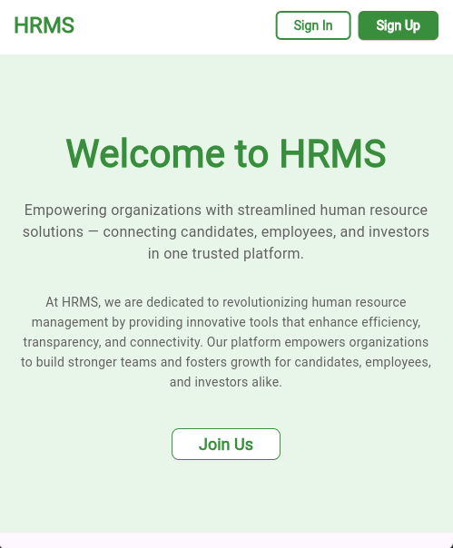                 |
| **Login**        | User authentication screen.                     | 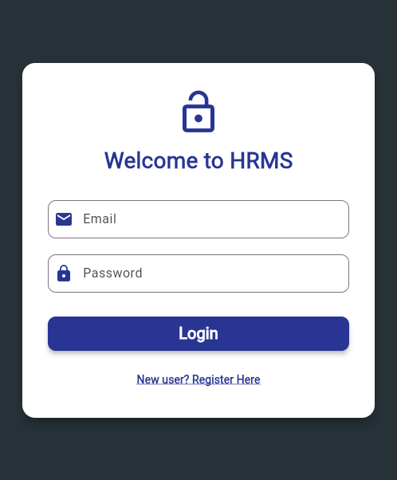               |
| **Registration** | New user sign-up screen.                        | 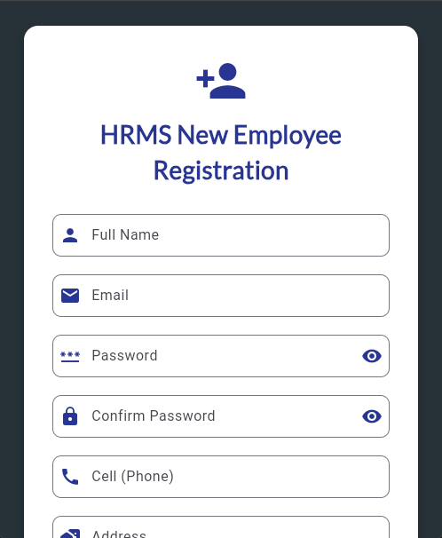 |

---

### 📊 Dashboards

| Screen                      | Role                                        | Screenshot                                              |
| :-------------------------- | :------------------------------------------ | :------------------------------------------------------ |
| **Admin Dashboard**         | Main overview for the System Administrator. |                   |
| **Dept Head Dashboard**     | Main overview for a Department Head.        | 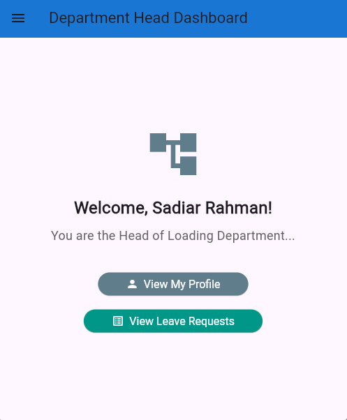     |
| **Drawer Menu (Admin)**     | Navigation menu access for Admin.           | 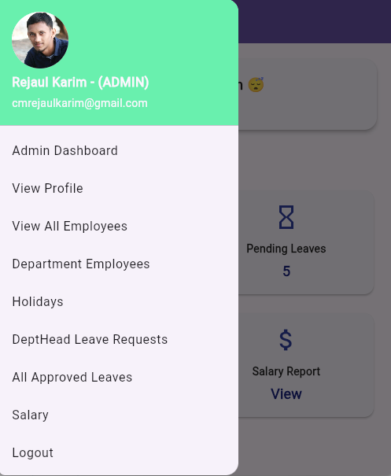              |
| **Drawer Menu (Dept Head)** | Navigation menu access for Department Head. |  |

---

### 👥 Employee Management

| Screen                   | Context                                          | Screenshot                                                     |
| :----------------------- | :----------------------------------------------- | :------------------------------------------------------------- |
| **All Employees**        | List of all employees (Admin view).              | 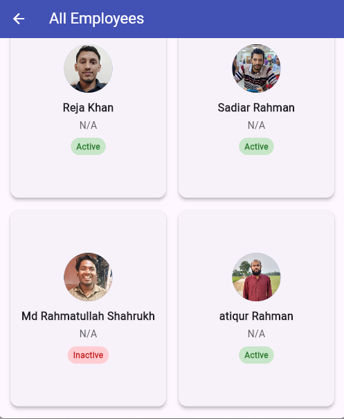             |
| **Employee Detail**      | Detailed profile view of an individual employee. | 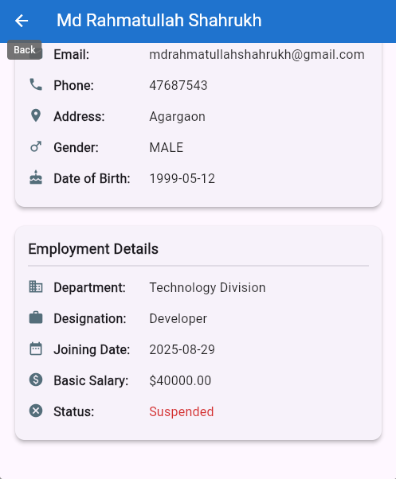         |
| **Employee Profile**     | The individual employee's personal profile view. | 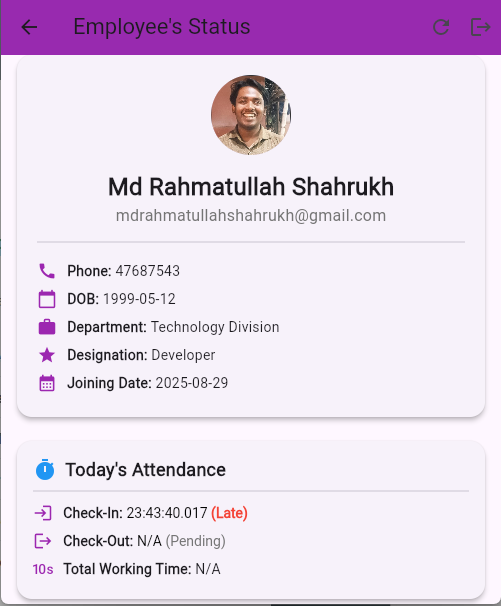                       |
| **Employee Attendance**  | View/Manage employee attendance records.         | 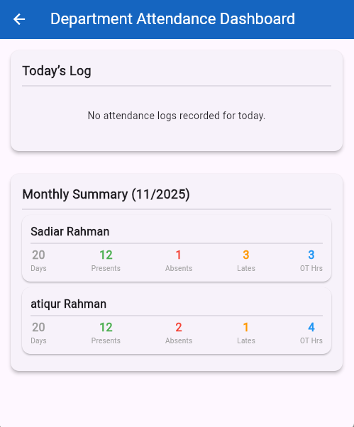 |
| **Department Employees** | List of employees specific to a department.      | 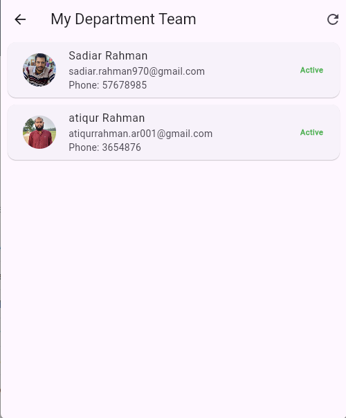            |
| **Holiday Calendar**     | View of the official company holidays.           | 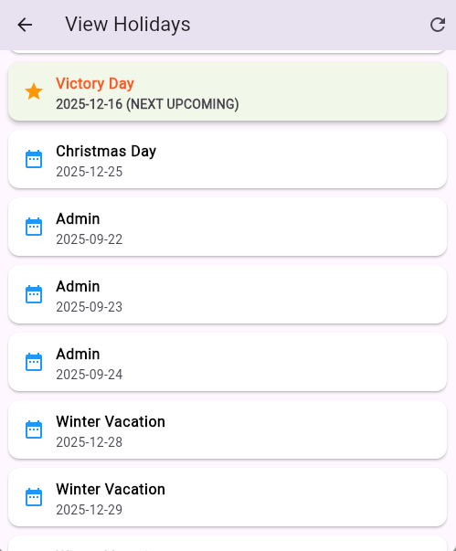                          |

---

### 📝 Leave & Advance Management

| Screen                     | Action/Role                                        | Screenshot                                                        |
| :------------------------- | :------------------------------------------------- | :---------------------------------------------------------------- |
| **All Approved Leaves**    | List of all approved leave requests (Admin).       | 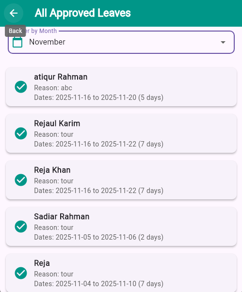     |
| **Dept Head Leave Mgt**    | Leave requests management for Department Head.     |           |
| **Employee Leave Request** | Screen for an employee to request a leave.         | 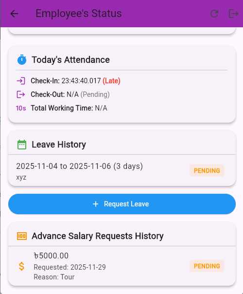                  |
| **Admin All Advances**     | List of all advance/loan requests (Admin view).    |    |
| **Approved Advances**      | List of approved advance requests (Admin view).    | 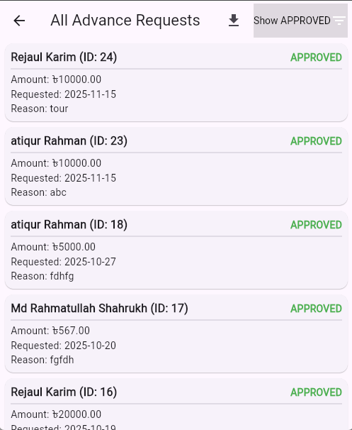 |
| **Advance Request (Emp)**  | Screen for an employee to request an advance/loan. | 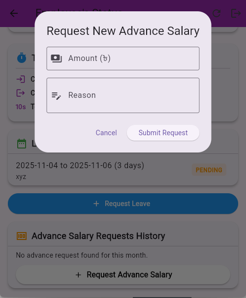                  |

---

### 💵 Accounting & Salary

| Screen                         | Report Type                                               | Screenshot                                                               |
| :----------------------------- | :-------------------------------------------------------- | :----------------------------------------------------------------------- |
| **Salary Report (Admin)**      | Detailed salary listing for Admin.                        | 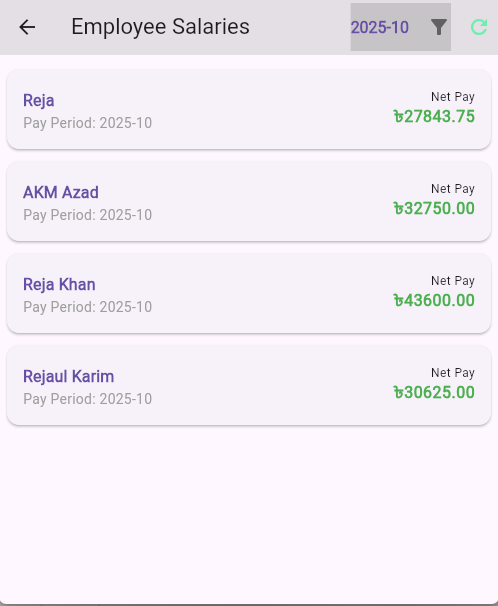               |
| **Salary Report (Accountant)** | Filtered view of employee salaries.                       | 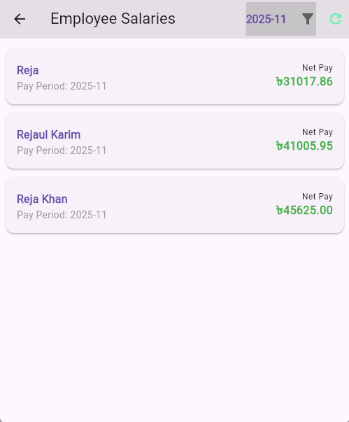      |
| **Employee Salary Report**     | Comprehensive salary report for an employee.              | 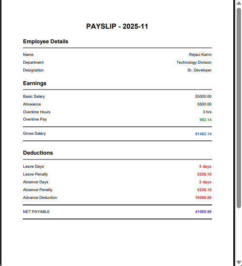 |
| **Add/Update Salary**          | Interface for adding or updating employee salary records. | 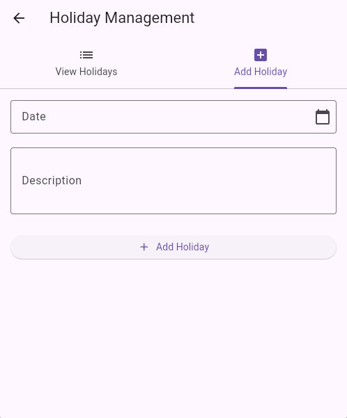                  |
| **Salary Slip**                | Generated payslip for an employee.                        | 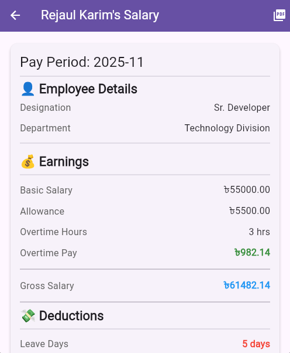              |

---